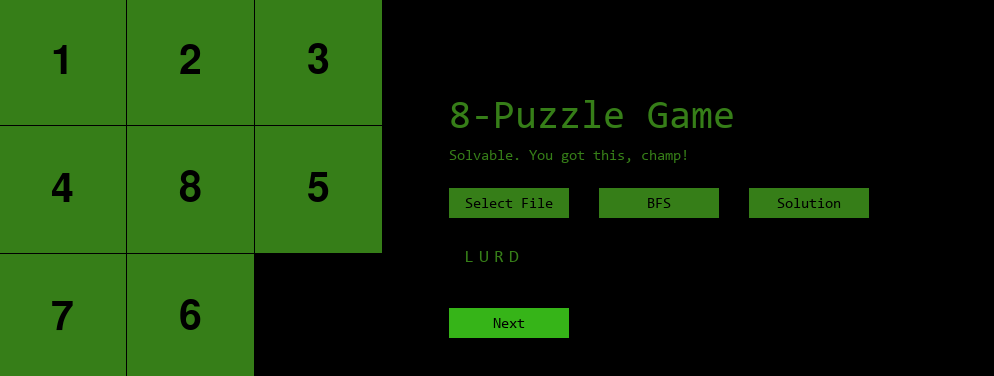

# Eight Puzzle Game with AI Searching Algorithm Solver

## Description
This is an interactive Python application using PyGame that allows users to solve the 8-puzzle game with three AI agents: BFS, DFS, and A-Star Search, providing various solution method

## Technologies Used

## Preparation
1. Make sure the following dependencies are installed in your device.
- numpy: `pip install numpy`
- pygame: `pip install pygame`
- pygame_widgets: `pip install pygame_widgets`

## Usage
1. To run the program, use the command `python main.py` or `py main.py`. 
2. When it loads, it will have a preloaded puzzle. The program has the following parts:
    - **Puzzle**: On the left side, the user will be able to play the usual slide game.
    - **Select file button**: This allows users to selet a puzzle file in `.in` file.
    - **Select Type button**: This shows a dropdown option of search algorithms to use to solve the puzzle.
    - **Solution button**: This activates the search algorithm to run, generating a solution of directional commands (Up, Down, Left, Right).
    - **Next button**: This goes through the generation solution automatically.

## Screenshots

*Screenshot of the Game with the pre-loaded puzzle*

*Screenshot of the dropdown menu of search algorithms*

*Screenshot of the generated solution*

*Screenshot of the automatically toggled 1st step in the solution using the Next button*

*Screenshot of the win screen*

## License
This project is licensed under the [Creative Commons Attribution-NonCommercial-ShareAlike (CC BY-NC-SA) 4.0 International License](https://creativecommons.org/licenses/by-nc-sa/4.0/).

## Additional Notes
This is an academic project part of CMSC 170 (Introduction to Artificial Intelligence) in UPLB.
